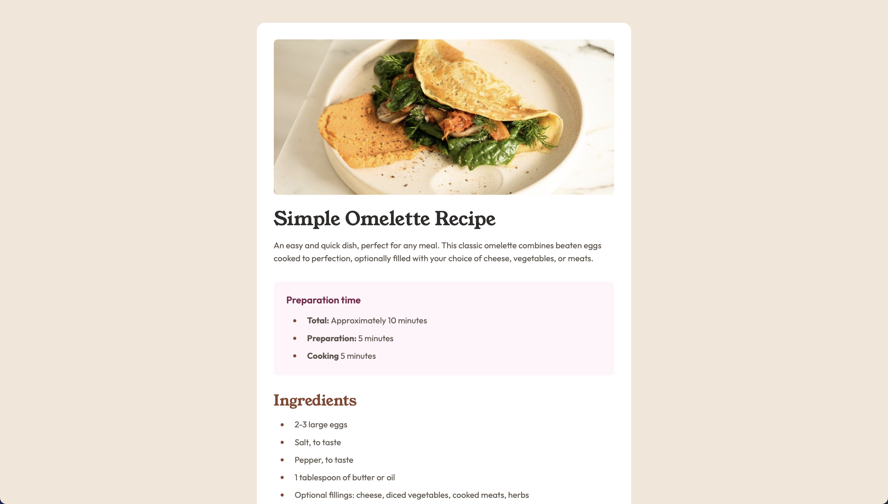

# Frontend Mentor - Recipe page solution

This is a solution to the [Recipe page challenge on Frontend Mentor](https://www.frontendmentor.io/challenges/recipe-page-KiTsR8QQKm). 

## Overview

### Screenshot

### Links

- Live Site URL: [sofiasmnk.github.io/frontendmentor-recipe-page](https://sofiasmnk.github.io/frontendmentor-recipe-page)

## My process

### Built with

- Semantic HTML5 markup
- CSS custom properties
- Flexbox
- CSS Grid